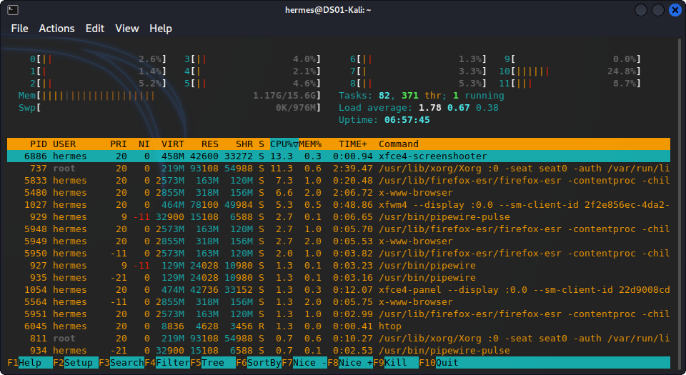

# A simple theme for Konsole or Qterminal 

Nothing Fancy other than a recolor that is configured with dark and mute colors to make it easy on the eyes. This is mostly for my personal use but others are free to use it if they please.

Terminal Preview:

## How to Use Custom Theme

1. Download the BlackMesa.schema file in this repository
2. Move it to where your terminal keeps it themes (in my case for Qterminal that is in `/usr/share/qtermwidget5/color-schemes`)
3. Open your terminal go to `File` --> `Preferences` go under appearance and select the new BlackMesa option.

Warning: I've run into issues with the theme being reset or not updating if other terminal windows are open so make sure to close all terminal windows after applying the theme for best results.
